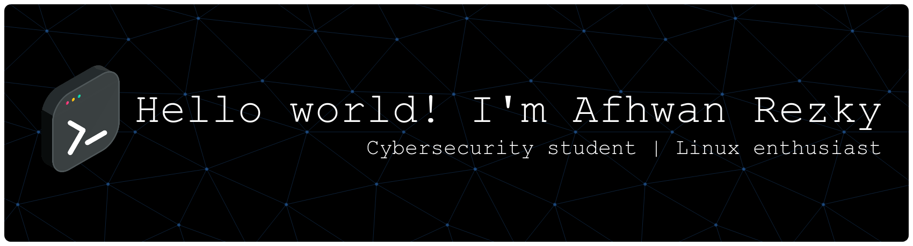

  

<h1 align="left">Hello world! i'm Afhwan Rezky Permana👋</h1>

###

About Me: I am a Network Information Systems and Applications student at SMKN 1 Jakarta, Indonesia. I am a fast learner and passionate about security. My ultimate goal is to become a Cybersecurity Engineer. 🛡️ Focus: Cybersecurity & Penetration Testing.  💻 Current Learning: Deepening Python, JavaScript, and advanced security concepts. 🐧 Linux Enthusiast: Kali Linux daily user and experienced with various distros.

###

Socials:

###

  
  

###

Tech Stack:

###

  
  
  
  
  
  
  
  
  
  
  
  
  
  
  
  
  
  
  
  
  
  
  
  
  
  
  
  
  
  
  
  
  
  
  
  
  
  
  
  
  
  
  

###

  

###

<h4 align="left">let's play a game!</h4>

###

 

<picture>
  <source media="(prefers-color-scheme: dark)" srcset="https://raw.githubusercontent.com/Afhwan/Afhwan/output/pacman-contribution-graph-dark.svg">
  <source media="(prefers-color-scheme: light)" srcset="https://raw.githubusercontent.com/Afhwan/Afhwan/output/pacman-contribution-graph.svg">
  
</picture>

###

  

###
